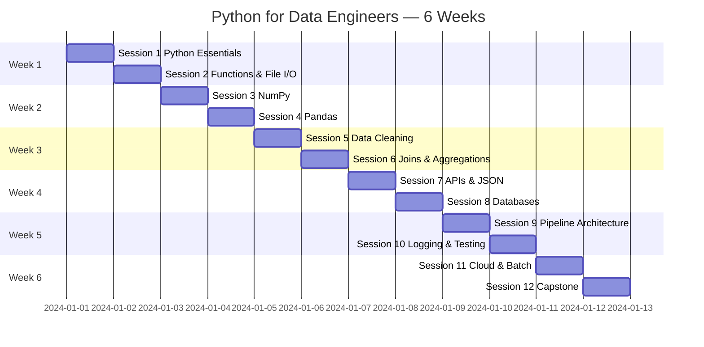

# Course Roadmap



## Skill progression

```
Week 1-2: Python + Pandas foundations
    ↓
Week 3:   Analytics-ready transforms
    ↓
Week 4:   External systems (API, DB)
    ↓
Week 5:   Production patterns
    ↓
Week 6:   Scale + capstone portfolio piece
```

## Materials per session

| # | Module | Slides (Marp + PPTX) | Lab |
|---|--------|----------------------|-----|
| 01 | [session-01](../modules/session-01.md) | `slides/marp/session-01.md` | lab-01 |
| 02 | [session-02](../modules/session-02.md) | `slides/marp/session-02.md` | lab-02 |
| 03 | [session-03](../modules/session-03.md) | `slides/marp/session-03.md` | lab-03 |
| 04 | [session-04](../modules/session-04.md) | `slides/marp/session-04.md` | lab-04 |
| 05 | [session-05](../modules/session-05.md) | `slides/marp/session-05.md` | lab-05 |
| 06 | [session-06](../modules/session-06.md) | `slides/marp/session-06.md` | lab-06 |
| 07 | [session-07](../modules/session-07.md) | `slides/marp/session-07.md` | lab-07 |
| 08 | [session-08](../modules/session-08.md) | `slides/marp/session-08.md` | lab-08 |
| 09 | [session-09](../modules/session-09.md) | `slides/marp/session-09.md` | lab-09 |
| 10 | [session-10](../modules/session-10.md) | `slides/marp/session-10.md` | lab-10 |
| 11 | [session-11](../modules/session-11.md) | `slides/marp/session-11.md` | lab-11 |
| 12 | [session-12](../modules/session-12.md) | `slides/marp/session-12.md` | capstone |
