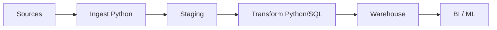

# Python for Data Engineers
## Session 1 — Environment & Python Essentials

**Week 1** | Lab 01: Parse Pipeline Logs

---

## Learning Objectives

- Explain where Python fits in a data engineering stack
- Set up `venv` and run scripts reproducibly
- Use lists, dicts, and strings to parse log lines

---

## Where Python Runs in Data Platforms



Python = **glue**, **SDKs**, **complex transforms**, **orchestration hooks**

---

## Development Setup

```bash
python -m venv .venv
source .venv/bin/activate
pip install -r requirements.txt
python labs/starter/lab-01.py
```

| Tool | Purpose |
|------|---------|
| venv | Isolate dependencies per project |
| pip | Install packages |
| IDE | Syntax, debugging, Git |

---

## Core Types

| Type | Example | DE use |
|------|---------|--------|
| `str` | `"ERROR"` | Log levels, IDs |
| `int` | `1500` | Row counts |
| `list` | `[1,2,3]` | Column names, batches |
| `dict` | `{"id": 1}` | JSON records |

---

## Parsing a Log Line

```python
line = "2024-01-15 10:23:01 ERROR payment timeout user_id=8821"
parts = line.split()
timestamp = " ".join(parts[:2])   # first two tokens
level = parts[2]
message = " ".join(parts[3:])
```

**Think:** ETL often starts as **string parsing**

---

## Collections for Records

```python
event = {
    "timestamp": "2024-01-15 10:23:01",
    "level": "ERROR",
    "service": "payment",
}
levels = ["INFO", "WARN", "ERROR"]
counts = {lvl: 0 for lvl in levels}
```

---

## Lab 01 Preview

1. Read `data/pipeline.log`
2. Parse timestamp, level, message
3. Count INFO / WARN / ERROR
4. Print summary dict

**Goal:** First end-to-end script — read file → transform → output

---

## Key Takeaways

- Python is the lingua franca of modern data pipelines
- Master **strings** and **dicts** before Pandas
- Always use a virtual environment

**Next:** Control flow, functions, file I/O → Lab 02
