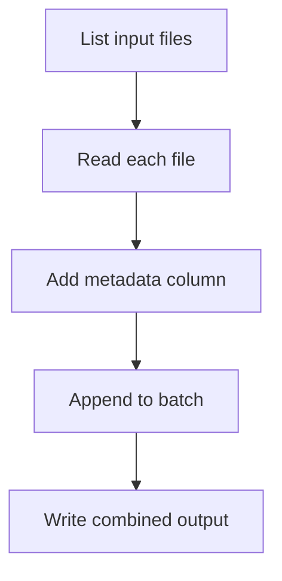

# Session 2
## Control Flow, Functions & File I/O

**Week 1** | Lab 02: Batch File Processor

---

## Learning Objectives

- Write reusable transform functions
- Read/write CSV safely
- Use `pathlib` for portable paths

---

## Functions = Pipeline Steps

```python
def normalize_email(raw: str) -> str:
    return raw.strip().lower()

def parse_row(row: dict) -> dict:
    row["email"] = normalize_email(row["email"])
    return row
```

**Rule:** One function → one responsibility

---

## List Comprehensions

```python
lines = open("data/pipeline.log").read().splitlines()
errors = [ln for ln in lines if " ERROR " in ln]
```

Compact mapping — use when readability stays high

---

## Context Managers (`with`)

```python
from pathlib import Path

def read_csv_rows(path: Path) -> list[dict]:
    import csv
    with path.open(newline="", encoding="utf-8") as f:
        return list(csv.DictReader(f))
```

Files **always** closed — critical for long-running jobs

---

## pathlib vs String Paths

```python
from pathlib import Path

inbox = Path("data/inbox")
for csv_file in inbox.glob("*.csv"):
    print(csv_file.name)
```

`Path("data") / "orders.csv"` works on **all** OSes

---

## Batch Processing Pattern



---

## Lab 02 Preview

Combine all CSVs in `data/inbox/` → `data/outbox/combined.csv`

Add `source_file` column for lineage tracking

---

## Key Takeaways

- Functions make pipelines **testable**
- `pathlib` + `with` = production habits early
- Comprehensions for simple filters/maps

**Next:** NumPy vectorization → Session 3
