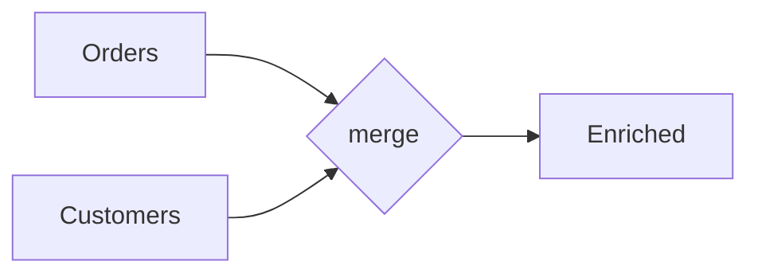

# Session 6
## Joins, GroupBy & Window Logic

**Week 3** | Lab 06: Daily Revenue Report

---

## Merge Types



| how | Keeps |
|-----|-------|
| inner | matches only |
| left | all left rows |
| outer | all from both |

---

## Validate Cardinality

```python
orders.merge(customers, on="customer_id", validate="m:1")
```

Catches accidental **many-to-many** explosions

---

## GroupBy Aggregations

```python
daily = (
    enriched.groupby(["order_date", "country"], as_index=False)
    .agg(revenue=("amount_usd", "sum"), orders=("order_id", "nunique"))
)
```

Named aggregations = readable SQL-like syntax

---

## Row Count Sanity Check

```python
print(len(orders), len(enriched))
```

If enriched >> orders → investigate join keys

---

## Lab 06

Daily revenue by country → `data/outbox/daily_revenue_by_country.csv`

---

## Key Takeaways

- Always validate merge cardinality
- Check row counts post-join
- `groupby` + `agg` replaces many SQL reports

**Next:** APIs & JSON → Session 7
