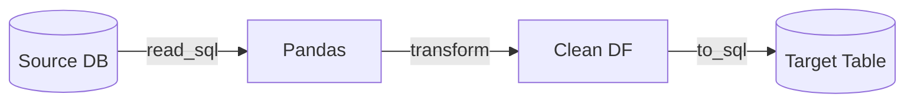

# Session 8
## Databases with Python

**Week 4** | Lab 08: SQLite ETL

---

## SQLAlchemy Engine

```python
from sqlalchemy import create_engine, text

engine = create_engine("sqlite:///data/retail.db")
```

Same pattern for Postgres, MySQL, BigQuery (with drivers)

---

## Extract → Transform → Load



---

## Safe Parameterized SQL

```python
with engine.connect() as conn:
    df = pd.read_sql(
        text("SELECT * FROM orders WHERE order_date >= :d"),
        conn,
        params={"d": "2024-01-01"},
    )
```

**Never** f-string SQL values — injection risk

---

## Load Strategies

| if_exists | Behavior |
|-----------|----------|
| `replace` | Drop & recreate |
| `append` | Add rows |
| `fail` | Error if exists |

Production: staging table + MERGE

---

## Lab 08

CSV → `raw_orders` → SQL filter → `analytics_orders`

---

## Key Takeaways

- SQLAlchemy abstracts connection strings
- Bound parameters for all dynamic SQL
- Choose append vs replace deliberately

**Next:** Pipeline architecture → Session 9
