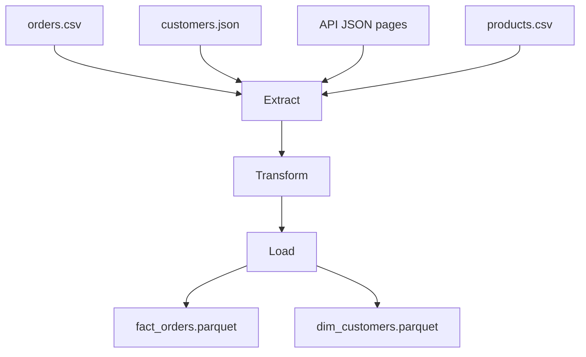

# Session 12
## Capstone — RetailPulse Pipeline

**Week 6** | End-to-End Project

---

## Capstone Goal

Build a **portfolio-ready** pipeline integrating everything from Weeks 1–6

---

## Architecture

---

## Requirements Checklist

- [ ] Multi-source extract
- [ ] Clean + join + enrich
- [ ] Parquet output
- [ ] config.yaml + logging
- [ ] ≥3 pytest tests
- [ ] README with run instructions

---

## Non-Functional Must-Haves

| Concern | Implementation |
|---------|----------------|
| Idempotent | partition overwrite / replace |
| Observable | structured logs |
| Testable | pure transform functions |
| Documented | README + config comments |

---

## Presentation (15 min)

1. **Architecture** — diagram + design choices
2. **Live demo** — `python capstone/run.py`
3. **Production next steps** — Airflow, monitoring, IAM

---

## Production Improvements to Discuss

- Orchestration (Airflow / Dagster)
- Secrets manager (not `.env` in prod)
- Data contracts & schema registry
- SLAs and alerting on freshness

---

## Congratulations!

You can now:

- Write Python ETL scripts
- Integrate APIs and databases
- Test and log pipelines
- Deliver analytics-ready datasets

**Ship your capstone — add it to your portfolio**
